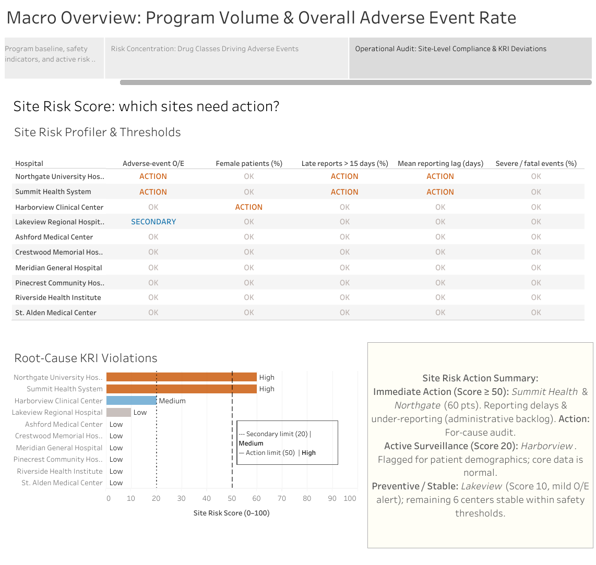

# Pharmacovigilance Risk Analytics — Pastela Pharmaceuticals



An end-to-end pharmacovigilance analytics project for the fictitious company **Pastela Pharmaceuticals**: a calibrated adverse-event risk score, site-level Key Risk Indicators (KRIs) with secondary and action limits, a programme Quality Tolerance Limit (QTL), and an accessible Tableau story. It follows the **PACE** framework (Plan, Analyze, Construct, Execute) and the risk-based quality management logic of ICH E6(R3) and E8(R1).

- **Interactive Tableau story:** https://public.tableau.com/shared/Y8T9TW82X
- **Blog post (EN · ES · FR · PT):** https://rodrigomachadobirollo.social-networking.me/en/blog/farmacovigilancia/
- **Project brief** (scenario, team, stakeholder interview, task list): [docs/pharma_analytics_project_brief.md](docs/pharma_analytics_project_brief.md)

> **Synthetic data.** Pastela Pharmaceuticals, its staff, patients, prescribers and every record are fictitious. The dataset was generated with Faker and NumPy from a hidden logistic risk model, and site-level problems were injected on purpose so the analysis has something real to find. No real patient data is included.

## Key findings

1. 2,381 adverse events across 31,583 treatments (7.5%) in 17,060 treated patients, 200 prescribers, 10 sites and 40 medications.
2. Risk concentrates in 9 of 40 medication classes (anthracyclines, platinum compounds, antimetabolites, calcineurin inhibitors, anticoagulants, opioids), at 18–22% vs. the 7.5% network average.
3. The risk score works as a triage tool: observed event rates are 4.6% (Low), 11.4% (Medium) and 21.0% (High).
4. Summit Health System and Northgate University Hospital breach the action limit: late reports and under-reporting (O/E ≈ 0.7) point to a data-entry backlog. Recommended: for-cause audit.
5. Harborview Clinical Center is flagged for its patient mix (89.5% female) while its data capture is normal.
6. The latest programme quarter fell below the secondary limit (O/E 0.78) but stayed above the QTL (0.70): the early warning fired first.

## Repository structure

```
pharma-data-analyst/
├── README.md
├── LICENSE
├── requirements.txt
├── data_analysis_portfolio_pharma.ipynb            # learner template (TODOs) — try it first
├── exemplar_data_analysis_portfolio_pharma.ipynb   # full PACE analysis (SQL → stats → ML → KRIs/QTL → Tableau export)
├── scripts/
│   ├── generate_pharma_data.py    # synthetic data generator (seeded, reproducible) → raw/
│   └── run_exemplar.py            # executes the notebook end to end
├── raw/                           # source tables (one CSV per relational table)
│   ├── patients.csv               # 20,000 patients
│   ├── doctors.csv                # 200 prescribers, 10 sites
│   ├── medications.csv            # 40 medications with WHO ATC category
│   ├── treatments.csv             # 31,583 treatments
│   ├── adverse_events.csv         # 2,381 adverse events
│   └── schema_pharma_analytics_db.sql
├── processed/                     # notebook outputs, ready for Tableau
│   ├── pharma_analytics.db                # SQLite database built from raw/
│   ├── tableau_pharma_risk_data.csv/.hyper # 1 row per treatment, with risk score and level
│   ├── tableau_site_risk.csv              # 1 row per site × KRI (status, limits, Site Risk Score)
│   ├── tableau_kri_by_hospital.csv        # observed/expected events by site with limits
│   └── tableau_qtl_quarterly.csv          # programme QTL by quarter
├── docs/
│   ├── pharma_analytics_project_brief.md  # stakeholder brief (fictitious scenario)
│   └── tableau_dashboard_guide.md         # step-by-step Tableau build guide (Spanish)
└── images/                                # dashboard and chart screenshots
```

## Reproduce

```bash
pip install -r requirements.txt
python scripts/generate_pharma_data.py   # regenerates raw/ (seed 42)
python scripts/run_exemplar.py           # runs the notebook and rewrites processed/
```

Or open the notebook in Jupyter from the repository root, so the relative paths `raw/` and `processed/` resolve. Then connect Tableau to `processed/tableau_pharma_risk_data.hyper` and the three site/QTL CSV files, following `docs/tableau_dashboard_guide.md`.

## Method in brief

- **Plan:** scope the question with (fictitious) pharmacovigilance and regulatory stakeholders: a prioritisation tool, not a diagnosis; accessible to a user with a visual impairment.
- **Analyze:** SQL extraction with SQLAlchemy, plausibility checks, feature engineering (age, BMI, dose ratio, polypharmacy, duration), chi-square, t-test and logistic regression. Late reports at two sites are kept as a *process* signal, not removed as outliers.
- **Construct:** logistic regression without leakage (no severity, site or prescriber), patient-grouped cross-validation, calibrated out-of-fold probabilities (ROC-AUC 0.69); a decision tree as an explanatory model.
- **Execute:** pre-specified risk levels tied to actions, site KRIs with secondary and action limits, observed/expected events by site and a quarterly programme QTL.

## Tools

Python (pandas, NumPy, SciPy, statsmodels, scikit-learn, matplotlib, seaborn, Faker, pantab), SQLite and SQLAlchemy, Jupyter, Tableau Public. Built with the help of Claude Code as an AI coding assistant.

## Author

**Rodrigo Machado Birollo** — [LinkedIn](https://www.linkedin.com/in/rodrigo-machado-birollo) · [Portfolio](https://rodrigomachadobirollo.social-networking.me/)

© 2026 Rodrigo Machado Birollo. **All rights reserved.** This repository is public for portfolio viewing only; the code, data and documentation may not be used, copied, modified or redistributed without written permission. See [LICENSE](LICENSE).
